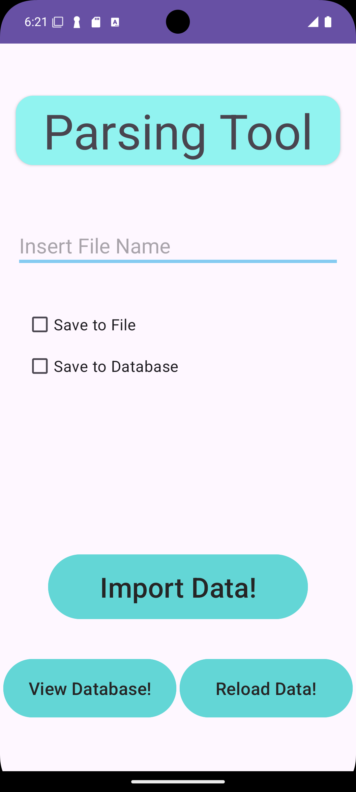
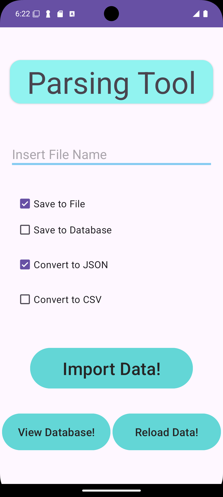
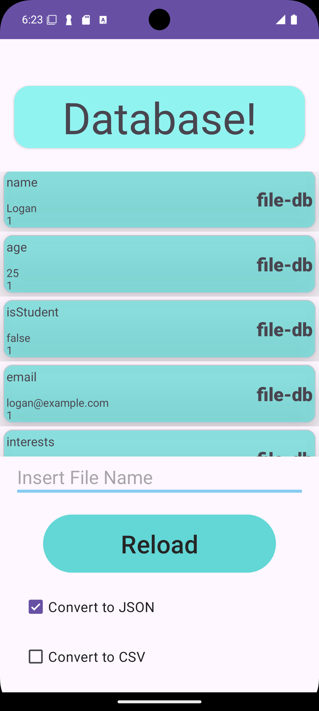
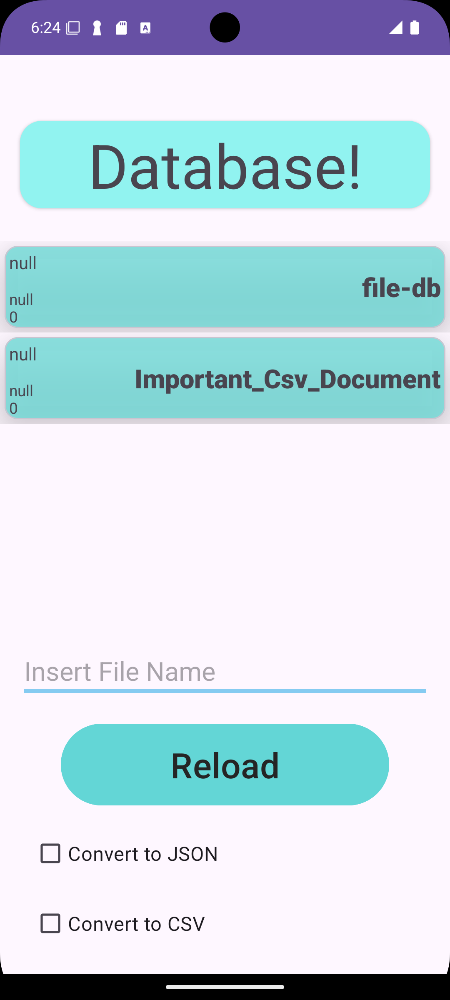
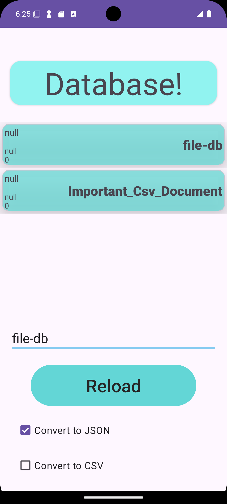

# Parsing and Saving Tool

An Android appplication designed to help you with parsing CSV or JSON data.

  &nbsp;&nbsp;   &nbsp;&nbsp; &nbsp;&nbsp;

## Instructions: Import Feature

In Android Studio go to Device Explorer:
<ul>
<li>View -> Tool Windows -> Device Explorer</li>
</ul>
With Device Explorer now open, navigate to documents:
<ul>
<li>sdcard -> documents</li>
</ul>

You may right-click the documents folder to upload files off of your computer.     

## Instructions: Export Feature: Find your files!

In Android Studio go to Device Explorer:
<ul>
<li>View -> Tool Windows -> Device Explorer</li>
</ul>
With Device Explorer now open, navigate to the project folder, com.freedman.parsingtool:
<ul>
<li>data -> data -> com.freedman.parsingtool -> files</li>
</ul>

Check files to see exports     

## Instructions: Clear your Database!

In Android Studio go to Device Explorer:
<ul>
<li>View -> Tool Windows -> Device Explorer</li>
</ul>
With Device Explorer now open, navigate to the project folder, com.freedman.parsingtool:
<ul>
<li>data -> data -> com.freedman.parsingtool -> databases</li>
</ul>

You may delete all 3 database files here to easily create a fresh database on relaunch.      

## Options to save as:
<ul>
<li>CSV</li>
<li>JSON</li>
</ul>

## Features
<ul>
<li>Uploading Files</li>
<li>Writing/Reading Files</li>
<li>Parsing Files</li>
<li>User Input for File Name</li>
<li>View your Database</li>
<li>AMAZING INTERFACE!</li>
</ul>
